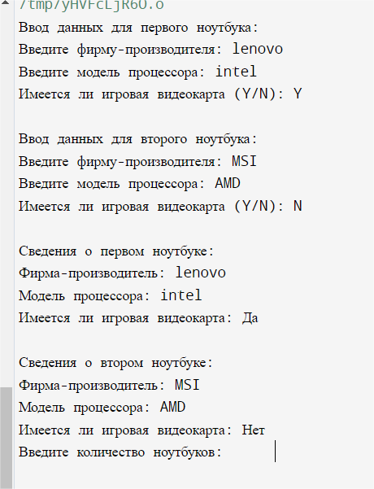

# Структуры
## Цель: знакомство с абстрактными типами данных

### Задачи:
1. Поставить цель.
2. Выбрать тип структуры.
3. Создать по 2 экземпляра структуры
4. Создать функцию вывода структуры: печатает сведения о экземпляре структуры.
5. Вывести результат работы
6. Вывод

### Вариант:2

```
#include <iostream>
#include <vector>

using namespace std;

// Структура для хранения характеристик ноутбука
struct Laptop {
    string manufacturer;
    string cpuModel;
    bool hasGamingGPU;
};

// Функция ввода параметров ноутбука
void inputLaptop(Laptop *laptop) {
    cout << "Введите фирму-производителя: ";
    cin >> laptop->manufacturer;
    cout << "Введите модель процессора: ";
    cin >> laptop->cpuModel;
    cout << "Имеется ли игровая видеокарта (Y/N): ";
    char hasGPU;
    cin >> hasGPU;
    laptop->hasGamingGPU = (hasGPU == 'Y' || hasGPU == 'y');
}

// Функция вывода сведений о ноутбуке
void printLaptop(const Laptop &laptop) {
    cout << "Фирма-производитель: " << laptop.manufacturer << endl;
    cout << "Модель процессора: " << laptop.cpuModel << endl;
    cout << "Имеется ли игровая видеокарта: " << (laptop.hasGamingGPU ? "Да" : "Нет") << endl;
}

// Функция для динамического создания экземпляров ноутбуков и сохранения их в векторе
vector<Laptop> createLaptops() {
    int numLaptops;
    cout << "Введите количество ноутбуков: ";
    cin >> numLaptops;

    vector<Laptop> laptops(numLaptops);
    for (int i = 0; i < numLaptops; i++) {
        cout << "Ввод данных для ноутбука " << (i + 1) << ":" << endl;
        inputLaptop(&laptops[i]);
    }

    return laptops;
}

int main() {
    // Создание двух экземпляров структуры
    Laptop laptop1;
    Laptop laptop2;

    // Ввод данных для первого ноутбука
    cout << "Ввод данных для первого ноутбука:" << endl;
    inputLaptop(&laptop1);

    // Ввод данных для второго ноутбука
    cout << endl << "Ввод данных для второго ноутбука:" << endl;
    inputLaptop(&laptop2);

    // Вывод сведений о первом ноутбуке
    cout << endl << "Сведения о первом ноутбуке:" << endl;
    printLaptop(laptop1);

    // Вывод сведений о втором ноутбуке
    cout << endl << "Сведения о втором ноутбуке:" << endl;
    printLaptop(laptop2);

    // Динамическое создание экземпляров ноутбуков и сохранение их в векторе
    vector<Laptop> laptops = createLaptops();

    // Вывод сведений о каждом ноутбуке из вектора
    cout << endl << "Сведения о ноутбуках из вектора:" << endl;
    for (const Laptop &laptop : laptops) {
        printLaptop(laptop);
        cout << endl;
    }

    return 0;
}
```

## Результат работы программы


## Вывод

 За проделанную работу мы поняли, как использовать указатели для доступа к данным в памяти и для передачи ссылок на объекты. А так же углубили понимание основных принципов ООП, таких как инкапсуляция и полиморфизм.


